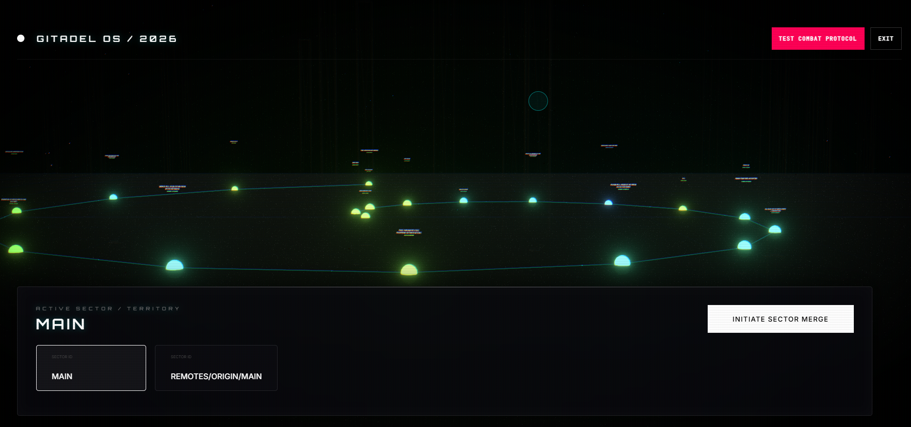

# Gitadel: Tactical Git Command Center

Gitadel is a high-fidelity, 3D Real-Time Strategy (RTS) interface for Git repository management. It transforms abstract version control history into a spatial metropolis, allowing developers to navigate, analyze, and manage their codebase through an immersive command-center environment.

## The Problem Statement  

Traditional Git interfaces whether CLI or GUI rely heavily on linear, text-based representations of history. This creates several operational bottlenecks:

1. Spatial Disconnect: As repositories grow to thousands of commits, developers lose the ability to visualize the scale and impact of changes across different time periods.
2. Cognitive Load: Understanding complex branching and merging structures requires significant mental effort to parse text logs and commit messages.
3. Fear of Conflict: Merge conflicts are often viewed through intimidating diff-viewers, making the resolution process stressful and error-prone.
4. Onboarding Friction: New contributors often struggle to "explore" a large codebase's history to identify major milestones or high-activity zones.

## The Solution

Gitadel re-imagines Git as a physical infrastructure. By translating version control data into 3D spatial data, it provides:

1. Macro-Level Intelligence: Commits are represented as Crystalline Monoliths. The geometry and height of each structure provide immediate visual feedback on the magnitude of the changes.
2. Temporal Navigation: The "Time Spiral" layout organizes the repository’s evolution into a cinematic path, allowing for intuitive fly-through exploration of the project's life cycle.
3. Tactical Conflict Resolution: Merge conflicts are handled through a specialized "War Zone" interface. It gamifies the resolution process, making it easier to distinguish between "Ally Code" and "Enemy Code" in a high-stakes, tactical environment.
4. Real-Time Command & Control: Gitadel is a functional tool, not just a viewer. It enables real-time branch checkouts, merges, and repository synchronization directly through the 3D interface.

## Technical Architecture

Gitadel is built on a high-performance stack designed for smooth 3D rendering and real-time system interaction:

- Frontend: React with @react-three/fiber and @react-three/drei for low-level WebGL management.
- Post-Processing: Advanced visual stack leveraging Bloom, ACES Filmic Tone Mapping, and Chromatic Aberration to achieve an Awwwards-level cinematic aesthetic.
- Backend: Node.js with Socket.io for real-time communication between the browser and the local Git filesystem.
- Git Engine: Custom implementation using Node's child processes to execute native Git commands with low latency.

## Key Features

### The Data Nebula
A sprawling 3D environment filled with "Ghost Skyscrapers" representing distant sectors and "Data Nebula" starfields that fill the visual horizon, providing a sense of immense scale.

### Monolith Analytics
Each commit building features a "Wobbling Energy Core" and holographic labels that billboard to always face the user, ensuring data readability from any camera angle.

### Data Pulse Visualization
Visualizing the flow of information through "Data Packets"—glowing spheres that travel along the nexus lines connecting different commits in the timeline.

### Aegis Command HUD
A glassmorphic, premium interface designed with Orbitron typography, providing a futuristic Command OS feel for all repository operations.

## Installation and Deployment

To deploy the Command Center locally:

1. Clone the repository to your local machine.
2. Navigate to the server directory and run `npm install` followed by `node index.js`.
3. Navigate to the client directory and run `npm install` followed by `npm run dev`.
4. Open the interface in a WebGL-compatible browser.
5. Enter your GitHub identity to begin synchronization.

## Verdict

Gitadel is designed for developers who demand more from their tools. It bridges the gap between engineering and artistic data visualization, turning the mundane task of version control into a strategic operation.
